// TODO @puhui999：这些后续需要删除哈
# IoT场景联动规则表单设计思路文档

## 概述

本文档详细描述了IoT场景联动规则表单的设计思路，包括表单结构、组件设计、数据流转和用户交互逻辑。通过Mermaid图直观展示各个组件之间的关系和数据流向。

## 表单整体架构设计

### 1. 表单主体结构

表单采用分步骤设计，包含以下主要部分：

- **基础信息配置**：场景名称、描述、状态
- **触发器配置**：设备触发或定时触发
- **执行器配置**：设备控制或告警配置
- **预览与保存**：配置预览和最终保存

### 2. 组件层次结构图

```mermaid
graph TB
    A[RuleSceneForm<br/>主表单组件] --> B[BasicInfoSection<br/>基础信息]
    A --> C[TriggerSection<br/>触发器配置]
    A --> D[ActionSection<br/>执行器配置]
    A --> E[PreviewSection<br/>预览区域]

    %% 基础信息组件
    B --> B1[NameInput<br/>场景名称输入]
    B --> B2[DescriptionInput<br/>场景描述输入]
    B --> B3[StatusRadio<br/>状态选择]

    %% 触发器配置组件
    C --> C1[TriggerTypeSelector<br/>触发类型选择器]
    C --> C2[DeviceTriggerConfig<br/>设备触发配置]
    C --> C3[TimerTriggerConfig<br/>定时触发配置]

    %% 设备触发配置子组件
    C2 --> C21[ProductSelector<br/>产品选择器]
    C2 --> C22[DeviceSelector<br/>设备选择器]
    C2 --> C23[PropertySelector<br/>属性选择器]
    C2 --> C24[OperatorSelector<br/>操作符选择器]
    C2 --> C25[ValueInput<br/>值输入]
    C2 --> C26[ConditionGroupConfig<br/>条件分组配置]

    %% 定时触发配置子组件
    C3 --> C31[CronInput<br/>CRON表达式输入]
    C3 --> C32[CronBuilder<br/>可视化CRON构建器]
    C3 --> C33[NextExecutionPreview<br/>下次执行时间预览]

    %% 执行器配置组件
    D --> D1[ActionTypeSelector<br/>执行类型选择器]
    D --> D2[DeviceControlConfig<br/>设备控制配置]
    D --> D3[AlertConfig<br/>告警配置]

    %% 设备控制配置子组件
    D2 --> D21[TargetProductSelector<br/>目标产品选择器]
    D2 --> D22[TargetDeviceSelector<br/>目标设备选择器]
    D2 --> D23[ControlTypeSelector<br/>控制类型选择器]
    D2 --> D24[ParamsConfig<br/>参数配置]

    %% 告警配置子组件
    D3 --> D31[AlertConfigSelector<br/>告警配置选择器]

    %% 预览区域组件
    E --> E1[ConfigPreview<br/>配置预览]
    E --> E2[ValidationResult<br/>验证结果]
    E --> E3[SaveButton<br/>保存按钮]

    %% 样式定义
    classDef mainComponent fill:#e1f5fe,stroke:#01579b,stroke-width:2px
    classDef sectionComponent fill:#f3e5f5,stroke:#4a148c,stroke-width:2px
    classDef subComponent fill:#e8f5e8,stroke:#1b5e20,stroke-width:2px

    class A mainComponent
    class B,C,D,E sectionComponent
    class B1,B2,B3,C1,C2,C3,C21,C22,C23,C24,C25,C26,C31,C32,C33,D1,D2,D3,D21,D22,D23,D24,D31,E1,E2,E3 subComponent
```

### 3. 组件层次结构文本

```text
RuleSceneForm (主表单)
├── BasicInfoSection (基础信息)
│   ├── NameInput (场景名称输入)
│   ├── DescriptionInput (场景描述输入)
│   └── StatusRadio (状态选择)
├── TriggerSection (触发器配置)
│   ├── TriggerTypeSelector (触发类型选择)
│   ├── DeviceTriggerConfig (设备触发配置)
│   │   ├── ProductSelector (产品选择器)
│   │   ├── DeviceSelector (设备选择器)
│   │   ├── PropertySelector (属性选择器)
│   │   ├── OperatorSelector (操作符选择器)
│   │   ├── ValueInput (值输入)
│   │   └── ConditionGroupConfig (条件分组配置)
│   └── TimerTriggerConfig (定时触发配置)
│       ├── CronInput (CRON表达式输入)
│       ├── CronBuilder (可视化CRON构建器)
│       └── NextExecutionPreview (下次执行时间预览)
├── ActionSection (执行器配置)
│   ├── ActionTypeSelector (执行类型选择)
│   ├── DeviceControlConfig (设备控制配置)
│   │   ├── TargetProductSelector (目标产品选择器)
│   │   ├── TargetDeviceSelector (目标设备选择器)
│   │   ├── ControlTypeSelector (控制类型选择器)
│   │   └── ParamsConfig (参数配置)
│   └── AlertConfig (告警配置)
│       └── AlertConfigSelector (告警配置选择器)
└── PreviewSection (预览区域)
    ├── ConfigPreview (配置预览)
    ├── ValidationResult (验证结果)
    └── SaveButton (保存按钮)
```

## 表单数据结构设计

### 1. 表单数据模型结构图

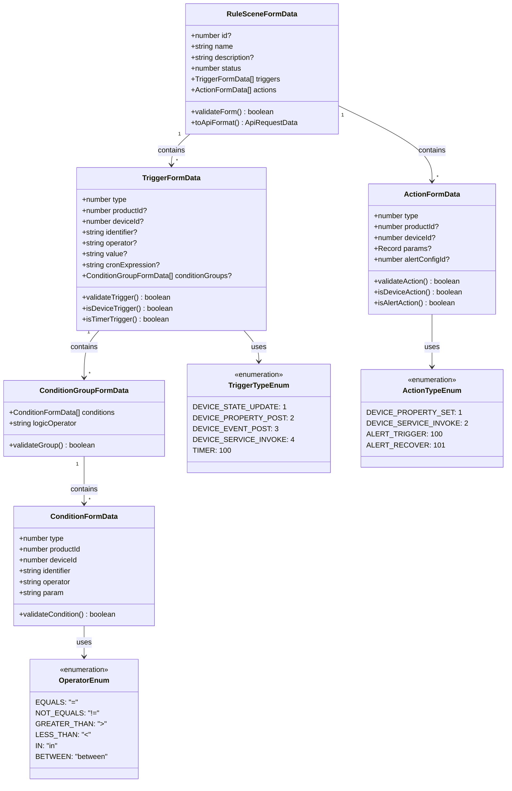

### 2. 表单数据模型代码

```typescript
interface RuleSceneFormData {
  // 基础信息
  id?: number;
  name: string;
  description?: string;
  status: number;

  // 触发器配置
  triggers: TriggerFormData[];

  // 执行器配置
  actions: ActionFormData[];
}

interface TriggerFormData {
  type: number;
  productId?: number;
  deviceId?: number;
  identifier?: string;
  operator?: string;
  value?: string;
  cronExpression?: string;
  conditionGroups?: ConditionGroupFormData[];
}

interface ActionFormData {
  type: number;
  productId?: number;
  deviceId?: number;
  params?: Record<string, any>;
  alertConfigId?: number;
}

interface ConditionGroupFormData {
  conditions: ConditionFormData[];
  logicOperator: 'AND' | 'OR';
}

interface ConditionFormData {
  type: number;
  productId: number;
  deviceId: number;
  identifier: string;
  operator: string;
  param: string;
}
```

### 2. 表单验证规则

```typescript
const validationRules = {
  name: [
    { required: true, message: '场景名称不能为空' },
    { max: 50, message: '场景名称不能超过50个字符' }
  ],
  status: [
    { required: true, message: '场景状态不能为空' },
    { type: 'enum', enum: [0, 1], message: '状态值必须为0或1' }
  ],
  triggers: [
    { required: true, message: '触发器配置不能为空' },
    { type: 'array', min: 1, message: '至少需要一个触发器' }
  ],
  actions: [
    { required: true, message: '执行器配置不能为空' },
    { type: 'array', min: 1, message: '至少需要一个执行器' }
  ]
};
```

## 核心组件设计

### 1. 基础信息组件 (BasicInfoSection)

```vue
<template>
  <el-card class="basic-info-section">
    <template #header>
      <span>基础信息</span>
    </template>
    
    <el-form :model="formData" :rules="rules" label-width="120px">
      <el-form-item label="场景名称" prop="name">
        <el-input 
          v-model="formData.name" 
          placeholder="请输入场景名称"
          maxlength="50"
          show-word-limit
        />
      </el-form-item>
      
      <el-form-item label="场景描述" prop="description">
        <el-input 
          v-model="formData.description" 
          type="textarea"
          placeholder="请输入场景描述"
          :rows="3"
          maxlength="200"
          show-word-limit
        />
      </el-form-item>
      
      <el-form-item label="场景状态" prop="status">
        <el-radio-group v-model="formData.status">
          <el-radio :label="0">开启</el-radio>
          <el-radio :label="1">关闭</el-radio>
        </el-radio-group>
      </el-form-item>
    </el-form>
  </el-card>
</template>
```

### 2. 触发器配置组件 (TriggerSection)

```vue
<template>
  <el-card class="trigger-section">
    <template #header>
      <div class="section-header">
        <span>触发器配置</span>
        <el-button type="primary" size="small" @click="addTrigger">
          <el-icon><Plus /></el-icon>
          添加触发器
        </el-button>
      </div>
    </template>
    
    <div v-for="(trigger, index) in triggers" :key="index" class="trigger-item">
      <div class="trigger-header">
        <span>触发器 {{ index + 1 }}</span>
        <el-button 
          type="danger" 
          size="small" 
          text 
          @click="removeTrigger(index)"
          v-if="triggers.length > 1"
        >
          删除
        </el-button>
      </div>
      
      <!-- 触发类型选择 -->
      <TriggerTypeSelector v-model="trigger.type" @change="onTriggerTypeChange(trigger, $event)" />
      
      <!-- 设备触发配置 -->
      <DeviceTriggerConfig 
        v-if="isDeviceTrigger(trigger.type)"
        v-model="trigger"
      />
      
      <!-- 定时触发配置 -->
      <TimerTriggerConfig 
        v-if="trigger.type === TriggerType.TIMER"
        v-model="trigger.cronExpression"
      />
    </div>
  </el-card>
</template>
```

### 3. 执行器配置组件 (ActionSection)

```vue
<template>
  <el-card class="action-section">
    <template #header>
      <div class="section-header">
        <span>执行器配置</span>
        <el-button type="primary" size="small" @click="addAction">
          <el-icon><Plus /></el-icon>
          添加执行器
        </el-button>
      </div>
    </template>
    
    <div v-for="(action, index) in actions" :key="index" class="action-item">
      <div class="action-header">
        <span>执行器 {{ index + 1 }}</span>
        <el-button 
          type="danger" 
          size="small" 
          text 
          @click="removeAction(index)"
          v-if="actions.length > 1"
        >
          删除
        </el-button>
      </div>
      
      <!-- 执行类型选择 -->
      <ActionTypeSelector v-model="action.type" @change="onActionTypeChange(action, $event)" />
      
      <!-- 设备控制配置 -->
      <DeviceControlConfig 
        v-if="isDeviceAction(action.type)"
        v-model="action"
      />
      
      <!-- 告警配置 -->
      <AlertConfig 
        v-if="isAlertAction(action.type)"
        v-model="action.alertConfigId"
      />
    </div>
  </el-card>
</template>
```

## 表单交互流程设计

### 1. 表单初始化流程图

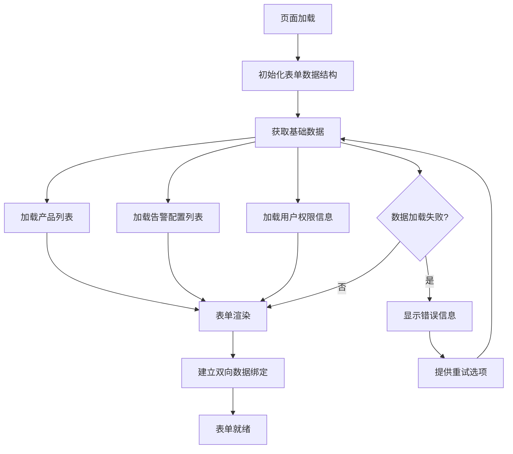

### 2. 触发器配置流程图

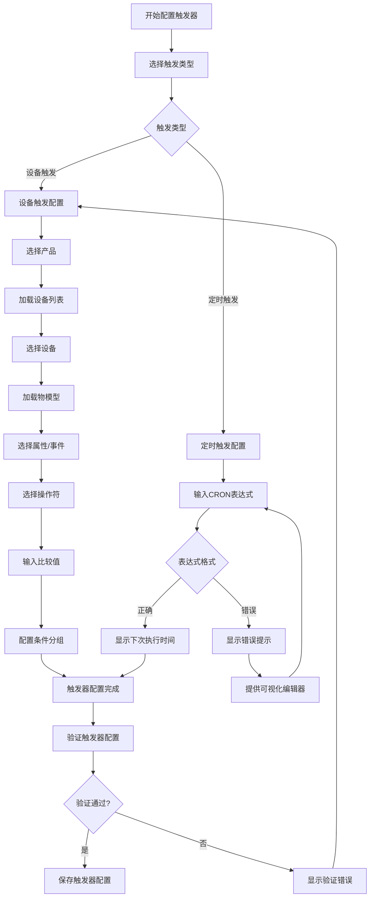

### 3. 执行器配置流程图

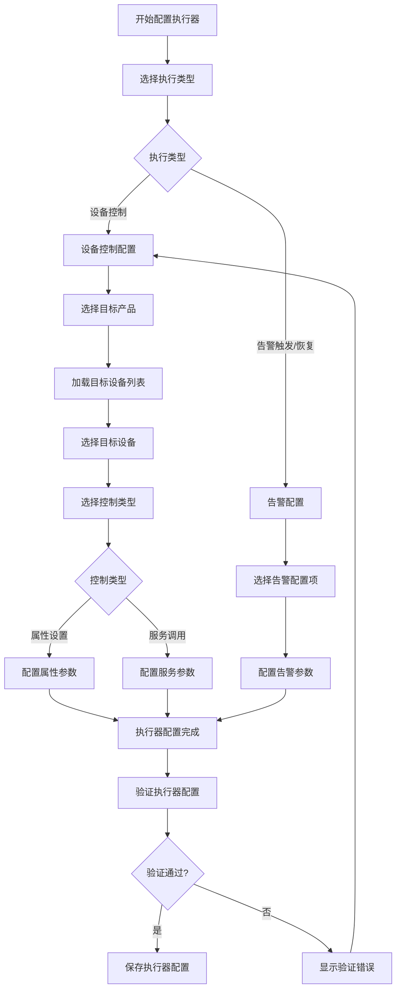

### 4. 表单提交流程图

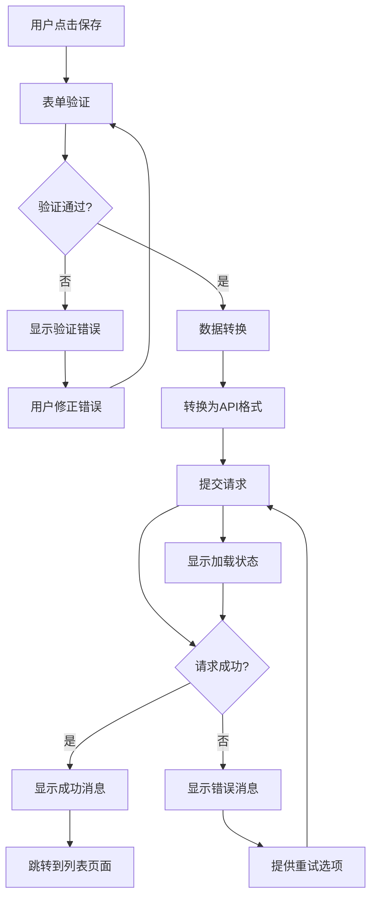

### 5. 数据流转图

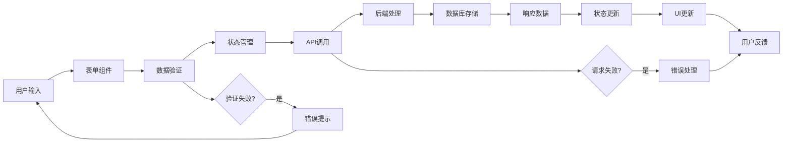

## 组件状态管理设计

### 1. 状态管理架构图

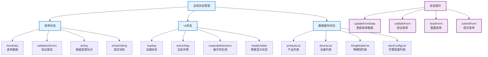

### 2. 组件通信图

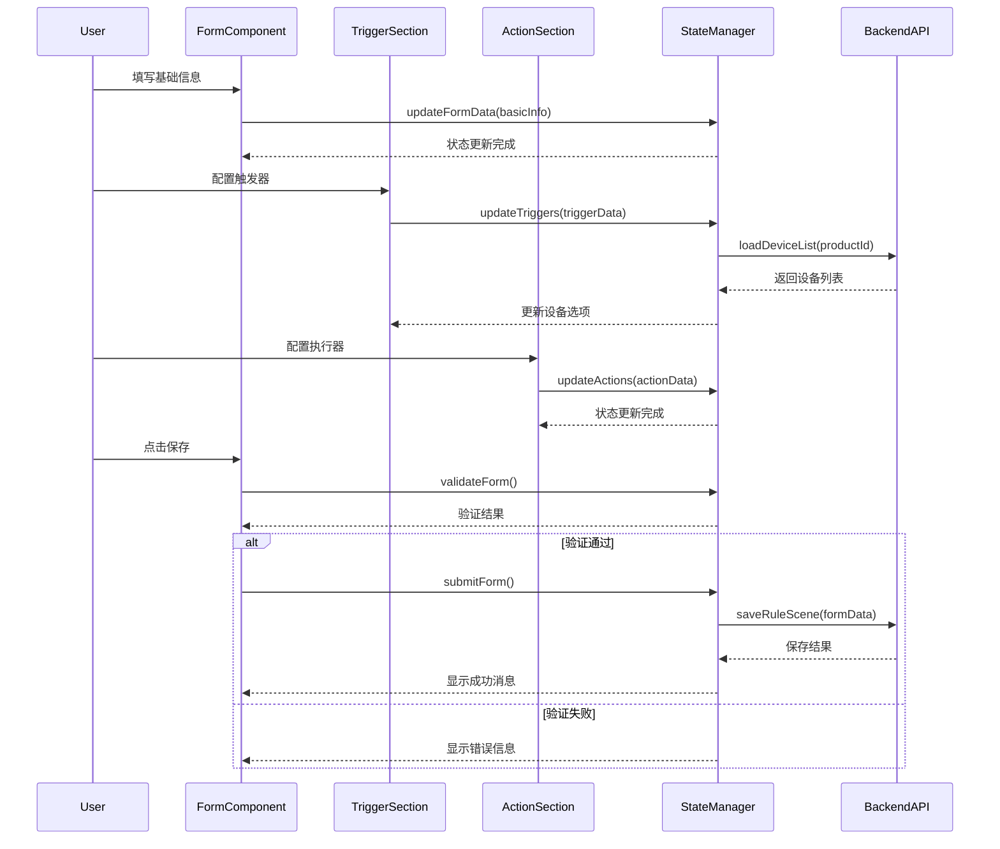

### 3. 数据流向图

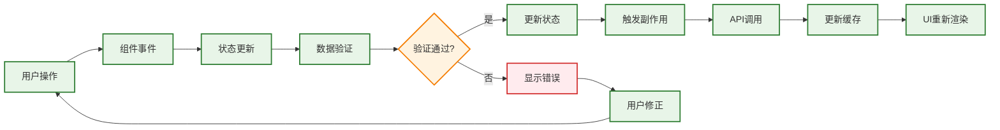

## 用户体验优化

### 1. 智能提示和帮助

- **字段说明**：为复杂字段提供详细说明和示例
- **实时验证**：输入时实时验证数据格式
- **智能推荐**：根据已选择的产品推荐相关设备
- **预览功能**：实时预览配置效果

### 2. 错误处理和反馈

- **表单验证**：清晰的错误提示信息
- **数据加载**：加载状态和错误重试机制
- **保存反馈**：明确的成功/失败反馈

### 3. 操作便利性

- **批量操作**：支持批量添加/删除触发器和执行器
- **模板功能**：提供常用场景模板
- **导入导出**：支持配置的导入和导出

## 响应式设计考虑

### 1. 移动端适配

- **布局调整**：在小屏幕上采用垂直布局
- **操作优化**：增大点击区域，优化触摸操作
- **内容精简**：在移动端隐藏非必要信息

### 2. 不同屏幕尺寸适配

- **大屏幕**：充分利用空间，并排显示更多内容
- **中等屏幕**：平衡内容密度和可读性
- **小屏幕**：优先显示核心功能

## 性能优化策略

### 1. 组件懒加载

```javascript
// 懒加载复杂组件
const DeviceTriggerConfig = defineAsyncComponent(() => 
  import('./components/DeviceTriggerConfig.vue')
);
```

### 2. 数据缓存

```javascript
// 缓存产品和设备数据
const productCache = new Map();
const deviceCache = new Map();
```

### 3. 防抖处理

```javascript
// 搜索防抖
const debouncedSearch = debounce(searchDevices, 300);
```

## 可访问性设计

### 1. 键盘导航

- 支持Tab键在表单元素间导航
- 提供快捷键操作

### 2. 屏幕阅读器支持

- 为表单元素提供适当的标签
- 使用ARIA属性增强可访问性

### 3. 颜色和对比度

- 确保足够的颜色对比度
- 不仅依赖颜色传达信息

## 表单验证策略

### 1. 验证层次结构图

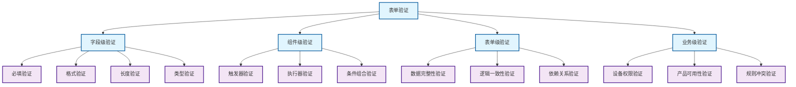

### 2. 验证时机图

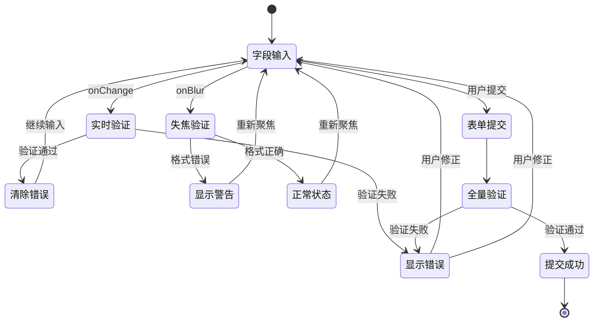

## 测试策略

### 1. 测试金字塔图

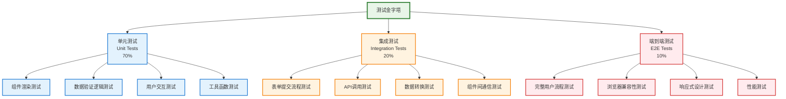

### 2. 测试用例覆盖图

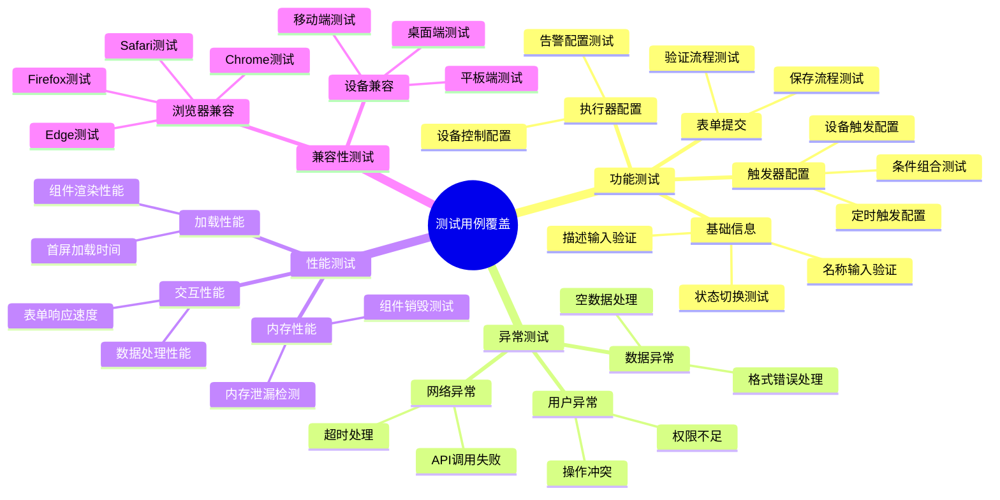

## 表单设计架构总览

### 完整架构图

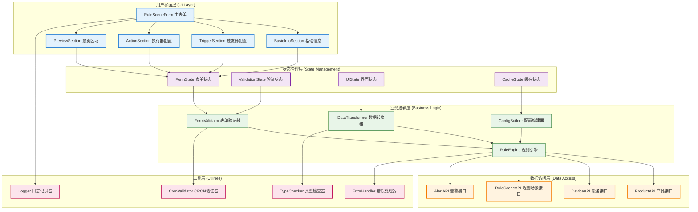

### 设计原则总结

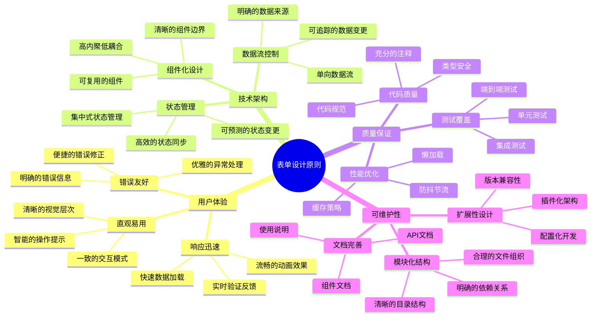

## 总结

IoT场景联动规则表单设计需要考虑：

### 1. 核心设计要点

- **复杂性管理**：通过组件化和分步骤设计降低复杂度
- **用户体验**：提供直观的操作界面和智能提示
- **数据完整性**：完善的验证机制确保数据质量
- **扩展性**：模块化设计支持功能扩展
- **性能优化**：合理的加载和缓存策略
- **可访问性**：确保所有用户都能正常使用

### 2. 技术实现要点

- **状态管理**：采用集中式状态管理，确保数据流的可控性
- **组件设计**：高内聚低耦合的组件架构，提高代码复用性
- **验证策略**：多层次的验证机制，保证数据质量
- **错误处理**：完善的错误处理和用户反馈机制
- **性能优化**：懒加载、缓存、防抖等优化策略

### 3. 质量保证

- **测试覆盖**：完整的测试金字塔，确保代码质量
- **文档完善**：详细的设计文档和使用说明
- **代码规范**：统一的编码规范和类型安全

通过以上设计思路和详细的Mermaid图表，可以构建一个功能完善、用户友好、技术先进的IoT场景联动规则配置表单系统。
